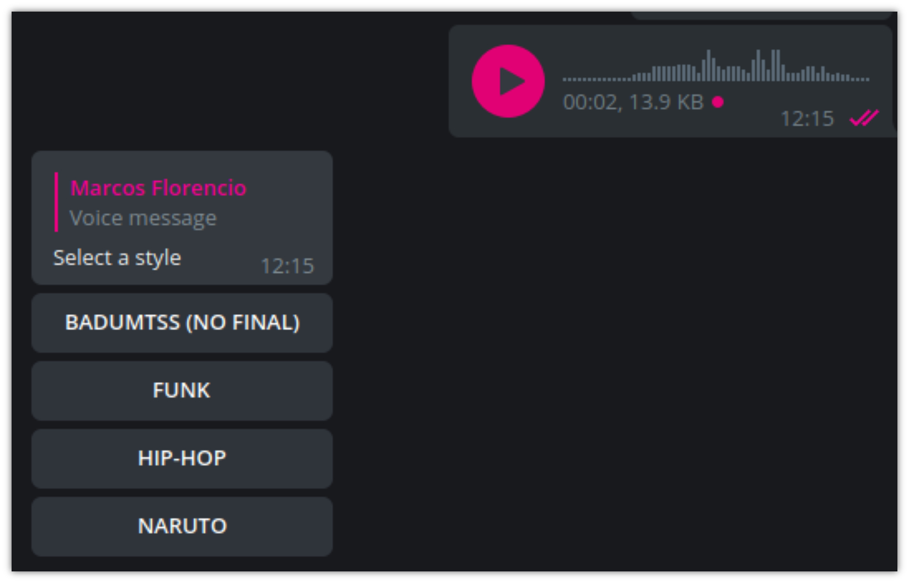

Esse bot é uma continução do meu [primeiro post](/telegram-bot/) primeiro POST onde mostro como criar um BOT e subir no now.sh.

Primeiramente peço perdão a todos DJs e produtores e que realmente mixam coisas, isso que vou mostrar uma brincadeira de final de semana entediado.

Eu sempre gostei muito de música mas infelizmente nunca aprendi tocar nada, e por não saber nada de música támbem nunca consegui trabalhar em produções. Esse experimento é uma forma de eu conseguir demonstrar meu amor por música.

Antes que você desista do texto, porque já escrevi de mais, esse é resultado final:

`youtube:https://www.youtube.com/embed/f-t-iY14bSM`
[_Converse com o DJ Marcinho no telegram_](https://t.me/DjMarcinhoBot)

----------
## Ingredientes

### ffmpeg
Mixagem de áudio programaticamente é uma coisa muito interassante, para esse bot utilizei o [ffmpeg](https://www.ffmpeg.org/). Uma solução de linha de comando open source para manipulação de áudio.

### now.sh
Uma plataforma para funções serverless que tem limites gratuitos bem generosos para códigos **OPEN SOURCE**

### node.js
A mano, uma plataforma que usa o V8 da google para tu conseguir criar servidores que rodam javascript.

----------
## Fluxo

### **I** - Bot aguarda evento de áudio enviado
Geralmente eu adiciono esse bot em grupos, a brincadeira fica mais legal. Como já mencionado estou utilizando o [telegraf](https://github.com/telegraf/telegraf) que felizmente consegue fazer a filtragem de mensagens programaticamente e separar isso em eventos para facilitar nossa vida.
```js
bot.on(['voice', 'audio'], ctx => {
 // lógicas aqui pipipi popopo
})
```

No final acabei inventando umas modas aqui, mas o conceito base é esse.

### **II** - Envia menu com opções de áudio


O projeto tem uma pasta com os áudios, estou fazendo uma listagem dos nomes dos arquivos com o FS para oferecer no menu posteriormente:

```js
// avaibleBeats.js

const { getBeatsPath } = require('lib/path')

const fs = require('fs')

const avaibleBeats = fs.readdirSync(getBeatsPath())

module.exports = {
  avaibleBeats
}
```

A partir dessa listagem dos aúdios disponíveis, montei uma lista de "callback button" (botão de retorno), o telegraf também abstrai isso de um jeito bem fácil.

```js
 const callBacks = avaibleBeats.map(beat =>
    [Markup.callbackButton(beat, beat)]
  )

  const inlineMessageRatingKeyboard = Markup
    .inlineKeyboard(callBacks).extra(
      // opção para responder diretamente no aúdio
      Extra.inReplyTo(ctx.message.message_id)
    )

  return ctx.reply(
    'Select a style',
    inlineMessageRatingKeyboard
  )
```

### **III** - Faz download do áudio enviado
```js
const saveFileLocal = async ({ filePath, bot, fileId }) => {
  const fileLink = await bot.telegram.getFileLink(fileId)

  const { data: fileStream } = await axios({
    url: fileLink,
    responseType: 'stream'
  })

  const writeFileStream = fs.createWriteStream(filePath)

  return new Promise((resolve, reject) => {
    writeFileStream.on('finish', resolve)
    writeFileStream.on('error', reject)

    fileStream
      .pipe(writeFileStream)
  })
}
```

**Explicando em detalhes:**
```js
const fileLink = await bot.telegram.getFileLink(fileId)
```
Constroi o link para download do arquivo de aúdio enviado pelo usuário.

----------

```js
const { data: fileStream } = await axios({
  url: fileLink,
  responseType: 'stream'
})
```

Veja esse post sobre [streams](https://imasters.com.br/back-end/streams-no-node-js-o-que-sao-streams-afinal-parte-01) caso não esteja familiarizado. Estou criando recebendo um fileStream da API do telegram e juntando isso à um writeFileStream, um stream de escrita para escrever o arquivo no disco.

----------

```js
return new Promise((resolve, reject) => {
  writeFileStream.on('finish', resolve)
  writeFileStream.on('error', reject)

  fileStream
    .pipe(writeFileStream)
})
```

Como estou usando devolvendo uma promise, passei o **resolve** e **reject** da promise para os eventos de **finish** e **error**.

Esse bot está rodando em serverless no [now.sh](now.sh). Em geral não é possivel escrever no disco de uma função serverless (_perdi um tempinho para descobrir isso na primeira vez_), então todos os áudios são salvos na pasta **TEMP** do **SO**. _Grazadeus_ no modulo **os** do node temos uma função chamada **tmpdir** que nos passa o caminho da pasta TEMP do SO em questão, assim fica mais fácil.

Aqui acabamos entrando em um tópico de privacidade, todos os áudios são **TEMPORÁRIOS**, nada fica salvo em nenhuma base de dados.

### **IV** - Aciona o ffmpeg para fazer o mix do aúdio do usário com a faixa selecionada

```js
const { stdout, stderr } = spawn(binariePatch, args, {})
  .on('error', reject)
  .on('close', () => resolve(outputDirectory))
```

Como comentei no inicio do POST estou utilizando o **ffmpeg**. Isso mesmo, eu subi o binário juntamente ao deploy e estou executando o mesmo usando o metodo **spawn** do módulo **child_process**.

**child_process** é um modulo nátivo no nodejs que permite que a gente crie novos processos a partir do processo principal. Com esse módulo o nosso bot cria um processo no sistema operacional executando um binário (**ffmpeg**) com os argumentos que precisava para fazer o mix do áudio acontecer.

O módulo **child_process** possui alguns metodos para esse típo de ação, dentre eles: **fork()**, **spawn()**, **exec()** e **execFile()**. Estou utilizando o método **spawn()** lançando um novo comando no SO, recebendo como respota um objeto do tipo **ChildProcess**, que implementa o **EventEmitter API** para felizmente nos permitir adicionar listeners (ouvintes), como fiz no código acima.

Argumentos de mix do **ffmpeg**:
```js
const mergeArgs = [
  '-y',
  '-i',
  filePath,
  '-i',
  beatPath,
  '-filter_complex',
  'amerge=inputs=2',
  '-ac',
  '2',
  outputDirectory
]
```

Essa é a forma que o bot monta os args para o mix de aúdio, no fim isso vai virar algo assim:

```bash
ffmpeg -y -i kaio_do_quebradev.ogg -i NARUTO_SAD_SONG.mp3 -filter_complex amerge=inputs=2 -ac 2 final.mp3
```
_Você pode executar isso no seu terminal se tiver o [binário do **ffmpeg**](https://ffmpeg.org/), vai rolar._

**Explicando os argumentos utilizados:**

**-y**:   
Confirmação de que você quer sobrescrever o arquivo de output, caso ele já exista.

**-i**:   
Informa um INPUT, um áudio que já existe e sera utilizado.

**-filter_complex**:   
Quando precisamos fazer algo mais cabreiro no FFMPEG usamos essa opção para conseguir chegar no resultado, o filter_complex permite que passemos como argumento para processamento do audio um "filter graph". Como o nome já diz é bem complexo então não vou me extender, até porque não sou um especialista no assunto.

Para esse argumento estou sempre informando **amerge=inputs=2** que quer dizer: **Eu quero que você faça o merge de dois streams de áudio em um só.**

**-ac:**   
Seta o número de canais de áudio. Nessa parte a gente já começa entrar em uma ciencia de foguete, coisa de quem manja de audio real (salve [Gustavo](https://twitter.com/gustv0_)). Então se quiser se aprofundar nessa parte [confira esse link](https://trac.ffmpeg.org/wiki/AudioChannelManipulation).

### **V** - Envia o áudio pro usuário

E Claro, a cereja do bolo, enviar o resultado para o usuário:
```js
  await ctx.replyWithAudio({ source: file })
```

### Visão geral (programática) do processo

```js
const selectedBeatName = info.actionName
const { fileId, fileType } = getFileInfo(ctx)
const filePath = getFilePath(fileId)

await saveFileLocal({ filePath, bot, fileId })

const outputMixPath = await mergeAudios({
  filePath,
  fileType,
  beat: selectedBeatName
})

const mixResult = getFileBuffer(outputMixPath)
await sendFile({ fileType, file: mixResult, ctx })
```

## Deploy
Segui basicamente as instruções do [meu primeiro post](/telegram-bot/), com um diferencial, na sessão de builds do **now.json** informei que o projeto deveria levar os binarios do FFMPEG e também as faixas de áudio disponíveis. _Se atente ao includeFiles_.

```js
"builds": [
  {
    "src": "index.js",
    "use": "@now/node-server",
    "config": {
      "includeFiles": [
        "binaries/**",
        "audios/**"
      ]
    }
  }
]
```

## Resultado final:

[_Converse com o DJ Marcinho no telegram_](https://t.me/DjMarcinhoBot)

[Código no github](https://github.com/eptaccio/dj-telegram-bot)

[Código rodando em PROD](https://zeit.co/eptaccio/djproducerbot/fvnyq8bgc/source)

Se tiver algum feedback ou conseguir construir algo legal a partir disso por favor me chame no [twitter](https://twitter.com/eptaccio) ou [telegram](https://t.me/eptaccio).

Obrigado por ler até o final.