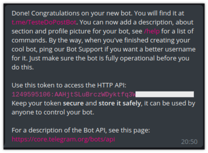
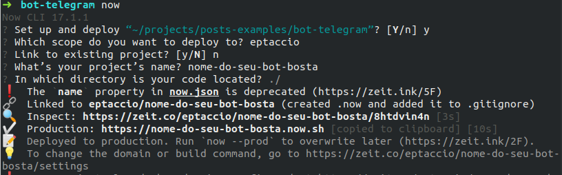
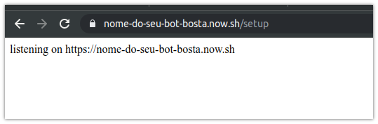

Eu gosto muito de criar bots, principalmente no telegram pela facilidade. Na verdade eu sempre fui um grande evangelista do Telegram, quem me conhece sabe disso. Então nada mais justo do que falar sobre bots nessa plataforma que simplifica muito o processo de criação dos mesmos.

Tá, basicamente vou mostrar duas coisas:
1. Como criar um chatbot (usando node.js)
2. Como deixar ele “rodando” de graça usando o now.sh

## Criando o bot no telegram
É bem fácil criar um bot no telegram, é tão facil que o telegram tem um bot que cria bots, no caso o [@BotFather](http://t.me/BotFather). É bem simples, inicie a conversa com o BotFather, execute o comando **/newbot** e siga as instruções. No final ele vai te gerar um token para você continuar com o processo.



## Vamos de código
Usando node.js vou mostrar uma lib para telegram deveras charmosa chamada Telegraf. A API oficial do telegram possui várias rotas e permite várias coisas, essa lib basicamente encapsula esses métodos para facilitar nossa vida.

A plataforma do telegram tem suporte a webhooks. É aí que entra nosso futuro deploy usando now.sh. O now é uma plataforma de zeit bem da hora que permite deploy de funções serverless.


Basicamente vamos precisar de uma API, para que o telegram chame a mesma quando algum usuário interagir com nosso BOT.

## Configurando nossa API para Webhook
O primeiro passo é criar uma API simples. Nesse exemplo vou usar express pela popularidade.

```js
// index.js

const express = require('express')
const Telegraf = require('telegraf')

const app = express()

const APP_PORT = 3000
const { BOT_TOKEN } = process.env
const CURRENT_HOST = ''

// instanciando o bot
const bot = new Telegraf(BOT_TOKEN, {
  telegram: {
    webhookReply: false
  }
})

// configuração de ação tosca no bot
bot.on('text', ctx => {
  return ctx.reply(
    `msg recebida de: ${ctx.message.from.username}`
  )
})

// união entre bot e express
app.use(bot.webhookCallback('/callback'))

app.get('/setup', async (_req, res) => {
  const url = `${CURRENT_HOST}/callback`
  await bot.telegram.setWebhook(url)
  res.send(`listening on ${CURRENT_HOST}`)
})

app.listen(APP_PORT, () => {
  console.log(`listening on ${APP_PORT}`)
})
```

O esquema é criar uma API simples, com uma rota de /setup inicialmente, que vai ser útil mais tarde. Claro, não esqueça de instalar os módulos (express e telegraf).

### Explicando por partes:

1 -- Instanciando nosso bot com o TOKEN que você gerou utilizando o BotFather lá no primeiro passo.
```js
// instanciando o bot
const bot = new Telegraf(BOT_TOKEN, {
  telegram: {
    webhookReply: false
  }
})
```

2 -- Configuração do o Webhook no telegram.
```js
app.get('/setup', async (_req, res) => {
  const url = `${CURRENT_HOST}/callback`
  await bot.telegram.setWebhook(url)
  res.send(`listening on ${CURRENT_HOST}`)
})
```

_-- Mas Marcos porque você uma rota para isso em vez de fazer na inicialização do código?_

Fiz assim para evitar uns pipocos depois de subir no now.sh, foi a melhora forma que encontrei por enquanto.

Nessa variável **CURRENT_HOST** vamos adicionar posteriormente a URL que o now vai nos fornecer para acesso da nossa API.

3 -- Definição de ação do BOT

```js
// configuração de ação tosca no bot
bot.on('text', ctx => {
  return ctx.reply(
    `msg recebida de: ${ctx.message.from.username}`
  )
})
```

Uma coisa legal do telegraf é que podemos definir ações com base em eventos, nesse caso um evento de texto digitado pelo usuário. Nesse caso vamos apenas responder que a mensagem foi respondida.

4 -- União entre telefraf e express
```js
app.use(bot.webhookCallback('/callback'))
```

Configuração para a instancia do BOT passar a funcionar e acionar os eventos disponíveis a partir de webhook.

## Configurando o deploy
Man, cria um conta no [now.sh](now.sh) depois instala o CLI deles com o npm (npm i -g now).

No código crie um arquivo chamado now.json na raiz do projeto. Nesse arquivo vamos fazer as configurações necessárias para o deploy da nossa função. Eu estou chamando isso de função pois, apesar de ser uma API no final das contas isso vai virar uma função serveless na estrutura do now, que por fins de curiosidade utiliza o AWS Lambda para funcionar, não me pergunte como esse pessoal ganha dinheiro.

_--Pera pera pera, vamos hospedar o bot nesse role de serveless ai e pa, mas quanto vai custar?_

Nada, o now tem uns limites bem generosos de funções rodando, desde que seja open source. A partir do momento que você faz um deploy **no modo FREE seu código fica automaticamente exposto na interwebs**, portanto fique **LIGEIRO** com coisas que não devem ser públicas, como o token do bot por exemplo. Utilize variáveis de ambiente. Na verdade, sempre utilize variáveis de ambiente para informações muito sensíveis, me ajude a te ajudar

A configuração que você precisa montar para o now rodar seu bot é basicamente essa:
```json
{
  "version": 2,
  "alias": [
    "nome-do-seu-bot-bosta.now.sh"
  ],
  "public": true,
  "builds": [
    {
      "src": "index.js",
      "use": "@now/node-server"
    }
  ],
  "routes": [
    {
      "headers": {
        "Access-Control-Allow-Origin": "*",
        "Access-Control-Allow-Methods": "GET, POST, PUT, DELETE, OPTIONS",
        "Access-Control-Allow-Headers": "X-Requested-With, Content-Type, Accept"
      },
      "src": "/.*",
      "dest": "/index.js"
    }
  ]
}
```

Você pode copiar essa config e substituir a parte do nome-do-seu-bot-bosta para o nome real do seu BOT já que ele já vai funcionar, deixei alguns outros comentários para explicar o que está rolando na config.

Lembra a variável CURRENT_HOST? Coloque nela o mesmo conteúdo que colocou no seu ALIAS da configuração do now.sh, mas adicionei um https nesse caso. Ex:
```js
const CURRENT_HOST = “https://nome-do-seu-bot-bosta.now.sh”
```

### Lançando o deploy
Abre o terminal ou CMD que tu tem ai e roda:
```bash
now -e BOT_TOKEN=token-do-seu-bot  - -prod
```

Bem simples né? Como é sua primeira vez (ou não) rodando isso, talvez ele te peça para fazer login e após isso ele vai mostrar informações sobre seu deploy.



Feito isso precisamos fazer a configuração do webhook no telegram chamando a rota **/setup** da nossa API. Então é so acessar a sua URL configurada na rota de setup.



Se correu tudo bem até aqui seu bot já vai estar respondendo.

E ai é você e sua criatividade. Veja o que mais o telegraf tem a oferecer para montar seus bots da hora.

Se tiver algum feedback ou conseguir construir algo legal por favor me chame no [twitter](https://twitter.com/eptaccio) ou [telegram](https://t.me/eptaccio).

Isso é tudo por enquanto, se pá eu volto mostrando como integrar seu BOT em mais plataformas.